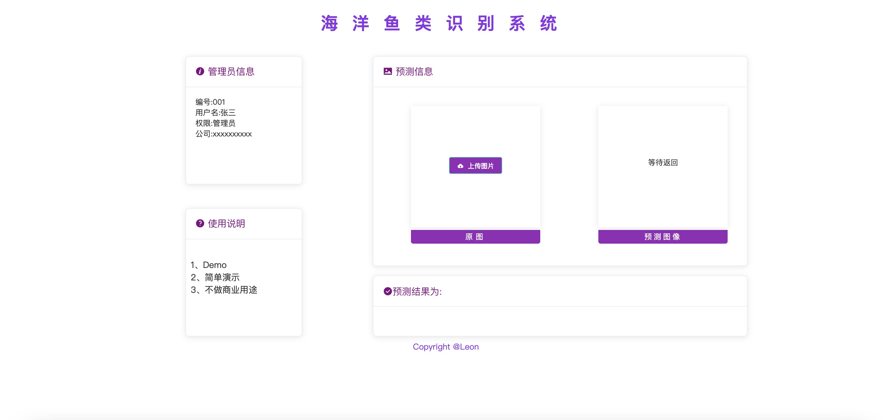
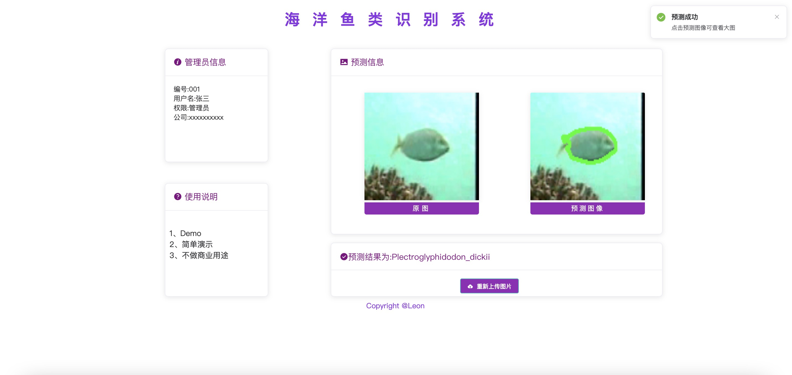

# fish_recognition
海洋鱼类识别系统

# 一.项目介绍

此项目基于paddlex的图片分类（ResNet50）和语义分割模块（FastSCNN）对输入的海洋鱼类图片进行名称识别和边界预测并输出，使用前后端分离架构部署（VUE+Flask）

代码包含：

```
fish_fontbone：前端部分代码

fish_backbone：后端部分代码

一张测试使用的图片：从数据集中随机找了一张

分类模型训练代码

分割模型训练代码
```

其中使用的数据集包含了23个鱼的种类，手动标注分割label比较耗时间，本demo标注很少一部分，标注工具使用labelme

数据集下载地址：链接: https://pan.baidu.com/s/1x90mrqGLvOy7U0f2fAMQGg 提取码: pa7l

模型训练代码的epoch数量比较少，为了节省时间。建议有时间有资源的小伙伴可以多训练几轮，可以提高模型的可用性。


模型下载地址：链接: https://pan.baidu.com/s/1aEaBXVEU5D8sRYxZC-t7pw 提取码: 2gjv

# 二.部署

依赖版本号：
```
python==3.8.11
numpy==1.19.5
```
1.下载代码到本地

```
git clone git@github.com:OsLeon/fish_recognition.git
```

2.安装paddle，padddlepaddle，paddlex和依赖组件

```
pip install paddle padddlepaddle paddlex -y
```
3.运行前需要把模型放入fish_backbone目录下

4.启动后端：

在fish_backbone目录下运行以下代码启动后端：

```
python app.py
```

5.启动前端

在fish_fontbone目录下运行以下代码安装VUE依赖：
```
npm install
```

运行以下代码启动前端：
```
npm run serve
```
根据提示打开本地项目地址即可

# 三.项目展示

使用前


使用后


